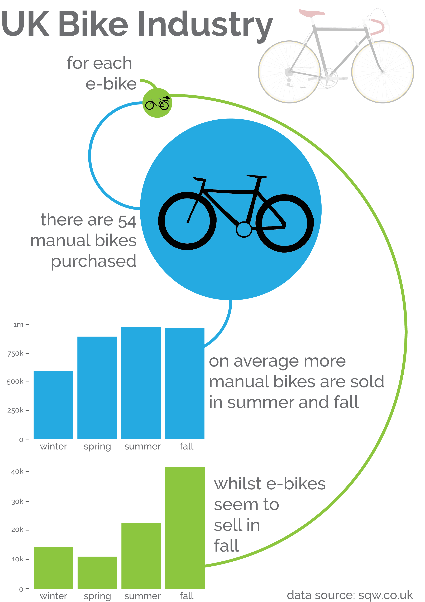

# The UK Bicycle Industry

Your mission, should you choose to accept it is to produce a data visualization about the bicycle industry in the United Kingdom. This time, I want you to create a narrative rather than just a single graph. See my example at the bottom of the page, the code, and various files I used to create this are found in the R folder (above in the list of files). I pulled out a headline number and used clip art I found on the internet to illustrate my visualization, I also used colours and semi-round arrows to keep in theme with wheels!

## Original Visualization

## About this Dataset

ARTICLE AND SOURCE: [SQW.co.uk](http://www.sqw.co.uk/files/6914/9406/9034/SQW_Economic_value_of_the_bicycle_industry_and_cycling_March_2017_FINAL.pdf)

## Objectives
Create a visualization based on the data provided, for inspiration, below is a visualization that I made. 
You must:
* Draw a graph or two in your preferred software.
* If you want, you can have a go with R, I have provided the R file and a few helpful hints in the R-folder.
* Edit the graph to be different to the standard generated plot.
* Create a story to tell (see my example below), and assemble this in a graphics package into a single page visualization. (You could use Powerpoint, Inkscape, Illustrator etc).

## My visualization for inspiration

